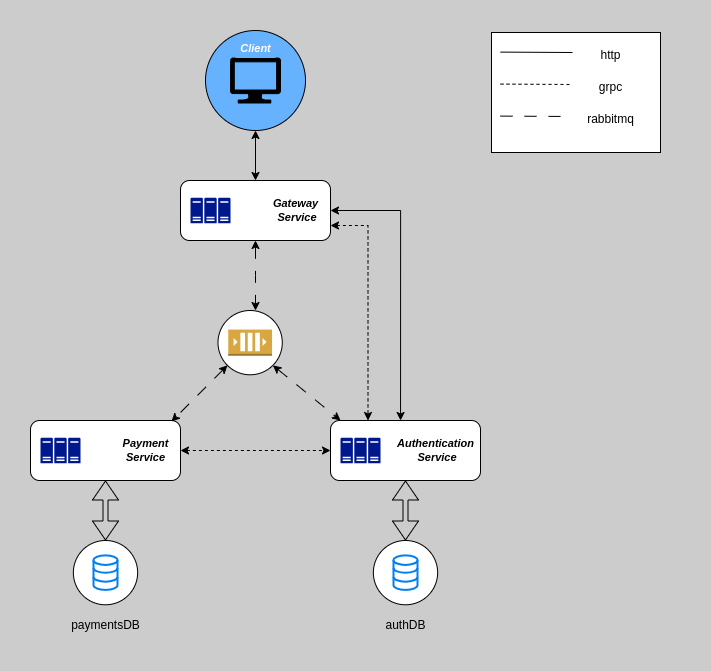
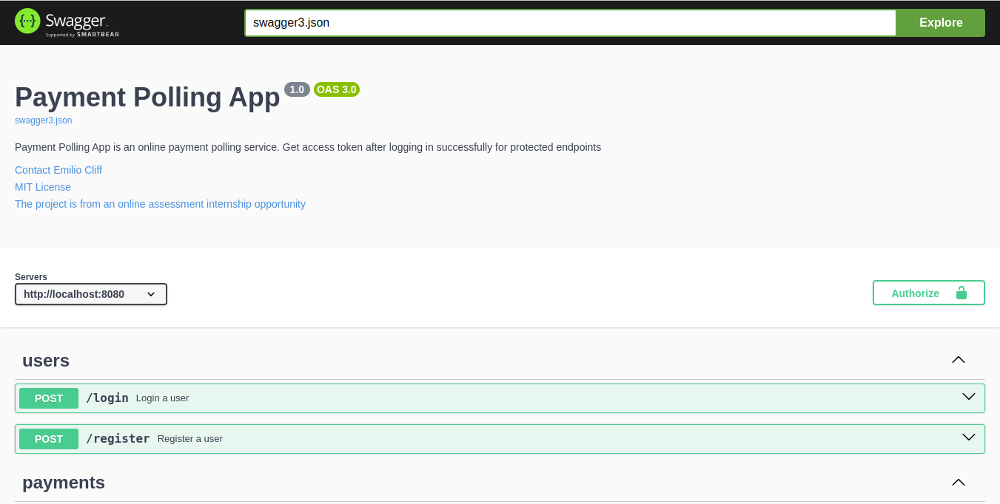

# Payment Polling System 🚀

Welcome to the **Payment Polling System**! This repository contains a collection of microservices built with Go for the [Payd Backend Assesment](.https://github.com/getpayd-tech/backend-intern-assesment). The project demonstrates a microservices architecture built with Go, Docker, and RabbitMQ. Each service is self-contained and serves a specific purpose in the larger architecture. Navigate to each service to learn more!



## Services Overview 🧩

- [Authentication Service](./authentication-service/README.md) - The authentication service connects to a postgres database. It serves the purpose of registering a new user and logging the user.
- [Gateway Service](./gateway-service/README.md) - This is the gateway/entry point to our system. Clients interact with this service and the request is forwarded to the respective service either through HTTP requests, gRPC or a rabbitMQ queue.
- [Payments Service](./payments-service/README.md) - The payments service connects to a postgres database. It serves the purpose of depositing and withdrawing funds from your Payd Wallet.

## Shared gRPC

- [Shared gRPC](./shared-grpc/README.md) - The shared gRPC contains the procedure calls needed for the system together with its mocks for testing purposes.

## Tech Stack 🛠️

- **Go**: Backend services.
- **gRPC**: Service communication.
- **Docker**: Containerization.
- **RabbitMQ**: Message broker.
- **Postgresql**: Service Database.
- **Testcontainers**: Intergration testing tool.

Explore the services by visiting their directories for more details.

## Getting Started 🛠️

To get started with the entire project, follow these steps:

1. **Clone the repository**

   ```bash
   git clone https://github.com/EmilioCliff/payment-polling-service.git
   ```

This next step require you to have docker compose installed and to set up an account in [Payd Account](.https://web.mypayd.app/login) for payments processing.

2. **Generating RSA key pair**

   We will need to generate RSA private and public keys for our system. The RSA private key is needed to **sign JWT tokens** using the RS256 algorithm, and the corresponding public key is used to **verify those tokens**. This is essential for asymmetric cryptography, where only the holder of the private key can generate valid tokens (authentication-service), but anyone with the public key can verify their authenticity (gateway service)

   - Navigate to the `./authentication-service/pkg` and run the following command

   ```
   # Generate private key

   openssl genpkey -algorithm RSA -out my_rsa_key.pem -pkeyopt rsa_keygen_bits:2048
   ```

   ```
   # Generate public key

   openssl rsa -pubout -in my_rsa_key.pem -out my_rsa_key.pub.pem
   ```

   - Copy the public key to the `./gateway-service/pkg`

3. **Run the services**

   ```bash
   docker compose up
   ```

4. **Making Request**
   After all the services are up you can go to the `localhost:8080/swagger/index.html`. SwaggerUI is used for the gateway service documentation with request and response examples, here you can start interacting with the system.



## Remarks 🤝

Happy Coding

## License 📝

This project is licensed under the MIT License.
